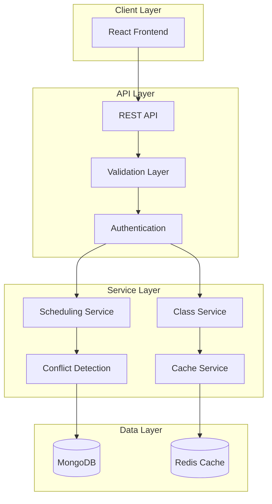
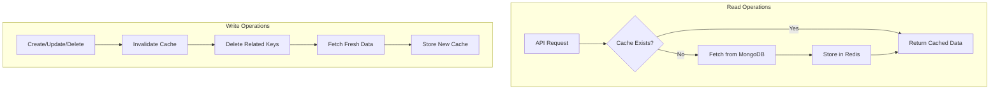
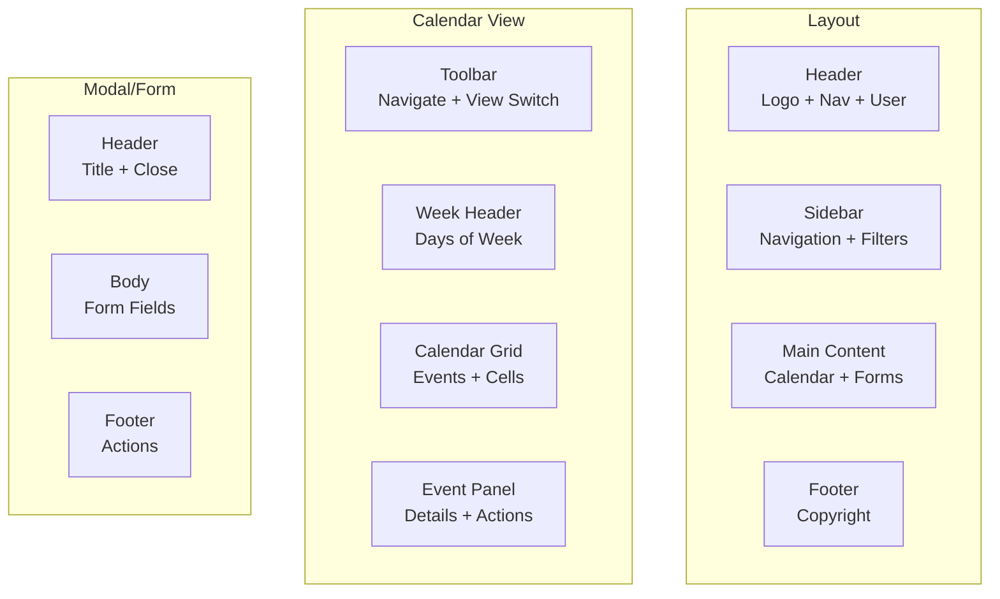

# Calendar-Based Class Scheduling System - Architectural Design Plan

## Table of Contents
1. [Project Overview](#project-overview)
2. [System Architecture](#system-architecture)
3. [Database Schema Design](#database-schema-design)
4. [API Design](#api-design)
5. [Redis Caching Strategy](#redis-caching-strategy)
6. [Scheduling Logic](#scheduling-logic)
7. [Frontend Architecture](#frontend-architecture)
8. [UI/UX Design](#uiux-design)
9. [Project Structure](#project-structure)
10. [Implementation Roadmap](#implementation-roadmap)

---

## 1. Project Overview

### 1.1 Purpose
Build a comprehensive calendar-based class scheduling system that supports both single-instance and recurring classes with flexible scheduling patterns, modern UI, and robust backend infrastructure.

### 1.2 Key Features
- **Class Management**: Create, read, update, delete classes (single & recurring)
- **Recurring Patterns**: Daily, weekly, monthly, and custom recurrence
- **Resource Management**: CRUD for room types and instructors
- **Conflict Detection**: Prevent scheduling conflicts
- **Caching Layer**: Redis for improved performance
- **Modern UI**: Responsive calendar interface

### 1.3 Tech Stack
- **Backend**: Node.js + TypeScript + Express
- **Database**: MongoDB with Mongoose
- **Caching**: Redis
- **Frontend**: React + TypeScript + Modern UI Library
- **API Format**: RESTful

---

## 2. System Architecture

### 2.1 High-Level Architecture



### 2.2 Component Interaction
- **Frontend** communicates only with REST API
- **Redis** acts as read-through cache for schedule data
- **MongoDB** is the source of truth
- **Services** handle business logic and scheduling patterns

---

## 3. Database Schema Design

### 3.1 MongoDB Collections

#### 3.1.1 RoomType Collection
```typescript
interface IRoomType {
  _id: ObjectId;
  name: string;           // e.g., "Lecture Hall", "Lab", "Studio"
  capacity: number;
  description?: string;
  amenities: string[];
  isActive: boolean;
  createdAt: Date;
  updatedAt: Date;
}

interface IRoom {
  _id: ObjectId;
  name: string;           // e.g., "Room 101"
  roomTypeId: ObjectId;
  building?: string;
  floor?: number;
  isActive: boolean;
  createdAt: Date;
  updatedAt: Date;
}
```

#### 3.1.2 Instructor Collection
```typescript
interface IInstructor {
  _id: ObjectId;
  firstName: string;
  lastName: string;
  email: string;
  phone?: string;
  specialization?: string;
  bio?: string;
  avatar?: string;
  isActive: boolean;
  createdAt: Date;
  updatedAt: Date;
}
```

#### 3.1.3 Class Collection (Base Class)
```typescript
interface IClass {
  _id: ObjectId;
  name: string;
  description?: string;
  courseCode?: string;
  instructorId: ObjectId;
  roomTypeId: ObjectId;
  roomId?: ObjectId;
  classType: 'single' | 'recurring';
  
  // Single class specific
  startDate: Date;
  endDate: Date;
  startTime: string;     // "09:00"
  endTime: string;        // "10:30"
  
  // Recurring class specific
  recurrence: {
    pattern: 'daily' | 'weekly' | 'monthly' | 'custom';
    daysOfWeek?: number[]; // 0-6 (Sunday-Saturday)
    dayOfMonth?: number[]; // 1-31
    interval?: number;     // Every N days/weeks/months
    timeSlots: {
      startTime: string;
      endTime: string;
    }[];
    endDate?: Date;        // When recurrence ends
    occurrences?: number;  // Max occurrences
    customRules?: string;  // RRule compatible string
  };
  
  // Recurring class instance tracking
  generatedInstances?: {
    instanceId: ObjectId;
    date: Date;
    startTime: string;
    endTime: string;
    status: 'scheduled' | 'completed' | 'cancelled';
  }[];
  
  isActive: boolean;
  createdAt: Date;
  updatedAt: Date;
}

interface IClassInstance {
  _id: ObjectId;
  parentClassId: ObjectId;
  date: Date;
  startTime: string;
  endTime: string;
  instructorId: ObjectId;
  roomId?: ObjectId;
  status: 'scheduled' | 'completed' | 'cancelled' | 'rescheduled';
  notes?: string;
  createdAt: Date;
  updatedAt: Date;
}
```

### 3.2 Indexes for Performance
```typescript
// Class Collection Indexes
db.classes.createIndex({ 'classType': 1, 'isActive': 1 });
db.classes.createIndex({ 'recurrence.pattern': 1 });
db.classes.createIndex({ 'startDate': 1, 'endDate': 1 });
db.classes.createIndex({ 'instructorId': 1 });
db.classes.createIndex({ 'roomTypeId': 1 });

// Class Instance Collection Indexes
db.class_instances.createIndex({ 'parentClassId': 1 });
db.class_instances.createIndex({ 'date': 1 });
db.class_instances.createIndex({ 'instructorId': 1, 'date': 1 });
db.class_instances.createIndex({ 'roomId': 1, 'date': 1 });
db.class_instances.createIndex({ 'status': 1 });
```

### 3.3 Aggregation Pipeline Examples

#### 3.3.1 Fetch Schedule with Pagination
```typescript
const getSchedulePipeline = (filters: ScheduleFilters, pagination: PaginationOptions) => [
  // Match filters
  {
    $match: {
      ...(filters.startDate && filters.endDate && {
        $or: [
          { 'recurrence.endDate': { $gte: filters.startDate } },
          { 'startDate': { $lte: filters.endDate } }
        ]
      }),
      ...(filters.instructorId && { 'instructorId': new ObjectId(filters.instructorId) }),
      ...(filters.roomTypeId && { 'roomTypeId': new ObjectId(filters.roomTypeId) }),
      ...(filters.pattern && { 'recurrence.pattern': filters.pattern }),
      isActive: true
    }
  },
  // Lookup related data
  {
    $lookup: {
      from: 'instructors',
      localField: 'instructorId',
      foreignField: '_id',
      as: 'instructor'
    }
  },
  {
    $lookup: {
      from: 'roomtypes',
      localField: 'roomTypeId',
      foreignField: '_id',
      as: 'roomType'
    }
  },
  {
    $lookup: {
      from: 'rooms',
      localField: 'roomId',
      foreignField: '_id',
      as: 'room'
    }
  },
  // Unwind arrays
  { $unwind: { path: '$instructor', preserveNullAndEmptyArrays: true } },
  { $unwind: { path: '$roomType', preserveNullAndEmptyArrays: true } },
  { $unwind: { path: '$room', preserveNullAndEmptyArrays: true } },
  // Add computed fields
  {
    $addFields: {
      instructorName: { $concat: ['$instructor.firstName', ' ', '$instructor.lastName'] }
    }
  },
  // Sort
  { $sort: { startDate: 1 } },
  // Pagination
  { $skip: (pagination.page - 1) * pagination.limit },
  { $limit: pagination.limit }
];
```

---

## 4. API Design

### 4.1 Response Format

#### 4.1.1 Error Response
```typescript
interface ApiError {
  title: string;      // e.g., "Validation Error"
  message: string;   // e.g., "Invalid schedule input"
  errors: {
    field: string;   // e.g., "startTime"
    message: string; // e.g., "Start time must be before end time"
  }[];
}
```

#### 4.1.2 Success Response (Paginated)
```typescript
interface PaginatedResponse<T> {
  title: string;     // e.g., "Classes fetched"
  message: string;   // e.g., "Class list loaded"
  data: T[];
  pagination: {
    total: number;
    page: number;
    limit: number;
    totalPages: number;
  };
}
```

#### 4.1.3 Success Response (Non-Paginated)
```typescript
interface ApiResponse<T> {
  title: string;
  message: string;
  data: T;
}
```

### 4.2 API Endpoints

#### 4.2.1 Room Types
| Method | Endpoint | Description |
|--------|----------|-------------|
| GET | `/api/room-types` | Get all room types (paginated) |
| GET | `/api/room-types/:id` | Get single room type |
| POST | `/api/room-types` | Create room type |
| PUT | `/api/room-types/:id` | Update room type |
| DELETE | `/api/room-types/:id` | Delete room type (soft delete) |

#### 4.2.2 Rooms
| Method | Endpoint | Description |
|--------|----------|-------------|
| GET | `/api/rooms` | Get all rooms (paginated) |
| GET | `/api/rooms/:id` | Get single room |
| POST | `/api/rooms` | Create room |
| PUT | `/api/rooms/:id` | Update room |
| DELETE | `/api/rooms/:id` | Delete room (soft delete) |

#### 4.2.3 Instructors
| Method | Endpoint | Description |
|--------|----------|-------------|
| GET | `/api/instructors` | Get all instructors (paginated) |
| GET | `/api/instructors/:id` | Get single instructor |
| POST | `/api/instructors` | Create instructor |
| PUT | `/api/instructors/:id` | Update instructor |
| DELETE | `/api/instructors/:id` | Delete instructor (soft delete) |

#### 4.2.4 Classes
| Method | Endpoint | Description |
|--------|----------|-------------|
| GET | `/api/classes` | Get all classes (paginated) |
| GET | `/api/classes/:id` | Get single class |
| POST | `/api/classes` | Create class (single or recurring) |
| PUT | `/api/classes/:id` | Update class |
| DELETE | `/api/classes/:id` | Delete class |
| POST | `/api/classes/:id/instances` | Generate instances for recurring class |
| GET | `/api/classes/calendar` | Get calendar view (date range) |

#### 4.2.5 Class Instances
| Method | Endpoint | Description |
|--------|----------|-------------|
| GET | `/api/instances` | Get all instances (paginated) |
| GET | `/api/instances/:id` | Get single instance |
| PUT | `/api/instances/:id` | Update instance |
| POST | `/api/instances/:id/cancel` | Cancel instance |
| POST | `/api/instances/:id/reschedule` | Reschedule instance |

### 4.3 Request/Response Examples

#### 4.3.1 Create Single Class
**Request:**
```json
POST /api/classes
{
  "name": "Introduction to Python",
  "description": "Learn Python basics",
  "courseCode": "CS101",
  "instructorId": "507f1f77bcf86cd799439011",
  "roomTypeId": "507f1f77bcf86cd799439012",
  "roomId": "507f1f77bcf86cd799439013",
  "classType": "single",
  "startDate": "2024-03-15",
  "endDate": "2024-03-15",
  "startTime": "09:00",
  "endTime": "10:30"
}
```

**Response:**
```json
{
  "title": "Class Created",
  "message": "Single class scheduled successfully",
  "data": {
    "id": "507f1f77bcf86cd799439099",
    "name": "Introduction to Python",
    "classType": "single",
    "startDate": "2024-03-15T00:00:00.000Z",
    "startTime": "09:00",
    "endTime": "10:30",
    "instructor": { ... },
    "roomType": { ... },
    "room": { ... }
  }
}
```

#### 4.3.2 Create Weekly Recurring Class
**Request:**
```json
POST /api/classes
{
  "name": "Advanced Mathematics",
  "classType": "recurring",
  "recurrence": {
    "pattern": "weekly",
    "daysOfWeek": [1, 3],  // Monday, Wednesday
    "timeSlots": [
      { "startTime": "10:00", "endTime": "11:30" },
      { "startTime": "14:00", "endTime": "15:30" }
    ],
    "endDate": "2024-06-15",
    "interval": 1
  },
  "instructorId": "507f1f77bcf86cd799439011",
  "roomTypeId": "507f1f77bcf86cd799439012"
}
```

#### 4.3.3 Create Monthly Recurring Class
**Request:**
```json
POST /api/classes
{
  "name": "Monthly Review Meeting",
  "classType": "recurring",
  "recurrence": {
    "pattern": "monthly",
    "dayOfMonth": [5, 20],  // 5th and 20th of each month
    "timeSlots": [
      { "startTime": "09:00", "endTime": "10:00" },
      { "startTime": "13:00", "endTime": "14:00" }
    ],
    "endDate": "2024-12-31",
    "interval": 1
  },
  "instructorId": "507f1f77bcf86cd799439011",
  "roomTypeId": "507f1f77bcf86cd799439012"
}
```

#### 4.3.4 Get Classes (Paginated)
**Request:**
```json
GET /api/classes?page=1&limit=10&startDate=2024-03-01&endDate=2024-03-31&instructorId=...
```

**Response:**
```json
{
  "title": "Classes Fetched",
  "message": "Class list loaded successfully",
  "data": [
    {
      "id": "507f1f77bcf86cd799439099",
      "name": "Introduction to Python",
      "classType": "single",
      "startDate": "2024-03-15T00:00:00.000Z",
      "startTime": "09:00",
      "endTime": "10:30",
      "instructor": { ... },
      "roomType": { ... }
    }
  ],
  "pagination": {
    "total": 45,
    "page": 1,
    "limit": 10,
    "totalPages": 5
  }
}
```

#### 4.3.5 Get Calendar View
**Request:**
```json
GET /api/classes/calendar?startDate=2024-03-01&endDate=2024-03-31&view=month
```

**Response:**
```json
{
  "title": "Calendar Data",
  "message": "Calendar view loaded successfully",
  "data": {
    "2024-03-05": [
      {
        "id": "507f1f77bcf86cd799439099",
        "name": "Advanced Mathematics",
        "startTime": "10:00",
        "endTime": "11:30",
        "instructor": { ... },
        "room": { ... },
        "isRecurring": true
      }
    ],
    "2024-03-07": [
      {
        "id": "507f1f77bcf86cd799439100",
        "name": "Physics Lab",
        "startTime": "14:00",
        "endTime": "16:00",
        "instructor": { ... },
        "room": { ... },
        "isRecurring": false
      }
    ]
  }
}
```

#### 4.3.6 Validation Error
**Response:**
```json
{
  "title": "Validation Error",
  "message": "Invalid schedule input",
  "errors": [
    {
      "field": "startTime",
      "message": "Start time must be before end time"
    },
    {
      "field": "recurrence.daysOfWeek",
      "message": "At least one day must be selected for weekly pattern"
    }
  ]
}
```

---

## 5. Redis Caching Strategy

### 5.1 Cache Key Structure
```
schedule:classes:{page}:{limit}:{filters}      // Paginated class list
schedule:calendar:{startDate}:{endDate}        // Calendar view data
schedule:class:{id}                             // Single class
schedule:instructor:{id}                       // Instructor data
schedule:room:{id}                             // Room data
schedule:roomtype:{id}                         // Room type data
```

### 5.2 Cache Flow


### 5.3 Cache Invalidation Rules
- **Class Created/Updated/Deleted**: Invalidate all schedule:* keys
- **Instructor Updated**: Invalidate schedule:instructor:{id}
- **Room Updated**: Invalidate schedule:room:{id}
- **Room Type Updated**: Invalidate schedule:roomtype:{id}
- **Time-based Expiration**: 1 hour TTL for all keys

### 5.4 Redis Implementation
```typescript
// Cache Service
class CacheService {
  private redis: Redis;
  private ttl = 3600; // 1 hour

  async get<T>(key: string): Promise<T | null> {
    const data = await this.redis.get(key);
    return data ? JSON.parse(data) : null;
  }

  async set(key: string, data: any): Promise<void> {
    await this.redis.setex(key, this.ttl, JSON.stringify(data));
  }

  async invalidate(pattern: string): Promise<void> {
    const keys = await this.redis.keys(pattern);
    if (keys.length > 0) {
      await this.redis.del(...keys);
    }
  }

  async getOrFetch<T>(key: string, fetcher: () => Promise<T>): Promise<T> {
    const cached = await this.get<T>(key);
    if (cached) return cached;
    
    const data = await fetcher();
    await this.set(key, data);
    return data;
  }
}

// Usage in Class Service
class ClassService {
  constructor(private cacheService: CacheService) {}

  async getClasses(filters: ClassFilters, pagination: PaginationOptions) {
    const cacheKey = this.generateCacheKey(filters, pagination);
    
    return this.cacheService.getOrFetch(cacheKey, async () => {
      return this.classRepository.getClassesWithAggregation(
        this.buildPipeline(filters),
        pagination
      );
    });
  }

  async createClass(data: CreateClassDTO): Promise<Class> {
    const newClass = await this.classRepository.create(data);
    
    // Invalidate cache
    await this.cacheService.invalidate('schedule:classes:*');
    await this.cacheService.invalidate('schedule:calendar:*');
    
    return newClass;
  }

  async updateClass(id: string, data: UpdateClassDTO): Promise<Class> {
    const updatedClass = await this.classRepository.update(id, data);
    
    // Invalidate cache
    await this.cacheService.invalidate(`schedule:class:${id}`);
    await this.cacheService.invalidate('schedule:classes:*');
    await this.cacheService.invalidate('schedule:calendar:*');
    
    return updatedClass;
  }

  async deleteClass(id: string): Promise<void> {
    await this.classRepository.softDelete(id);
    
    // Invalidate cache
    await this.cacheService.invalidate(`schedule:class:${id}`);
    await this.cacheService.invalidate('schedule:classes:*');
    await this.cacheService.invalidate('schedule:calendar:*');
  }
}
```

---

## 6. Scheduling Logic

### 6.1 Recurrence Pattern Processing

#### 6.1.1 Daily Pattern
```typescript
function generateDailyInstances(
  startDate: Date,
  endDate: Date,
  timeSlots: TimeSlot[],
  interval: number = 1
): ClassInstance[] {
  const instances: ClassInstance[] = [];
  const currentDate = new Date(startDate);

  while (currentDate <= endDate) {
    for (const slot of timeSlots) {
      instances.push({
        date: new Date(currentDate),
        startTime: slot.startTime,
        endTime: slot.endTime,
        status: 'scheduled'
      });
    }
    
    currentDate.setDate(currentDate.getDate() + interval);
  }

  return instances;
}
```

#### 6.1.2 Weekly Pattern
```typescript
function generateWeeklyInstances(
  startDate: Date,
  endDate: Date,
  daysOfWeek: number[],  // 0-6 (Sunday-Saturday)
  timeSlots: TimeSlot[],
  interval: number = 1
): ClassInstance[] {
  const instances: ClassInstance[] = [];
  let currentWeekStart = new Date(startDate);
  
  // Find the first occurrence
  while (currentWeekStart <= endDate) {
    for (const dayOfWeek of daysOfWeek) {
      const instanceDate = new Date(currentWeekStart);
      instanceDate.setDate(instanceDate.getDate() + dayOfWeek);
      
      if (instanceDate >= startDate && instanceDate <= endDate) {
        for (const slot of timeSlots) {
          instances.push({
            date: new Date(instanceDate),
            startTime: slot.startTime,
            endTime: slot.endTime,
            status: 'scheduled'
          });
        }
      }
    }
    
    currentWeekStart.setDate(currentWeekStart.getDate() + (7 * interval));
  }

  return instances;
}
```

#### 6.1.3 Monthly Pattern
```typescript
function generateMonthlyInstances(
  startDate: Date,
  endDate: Date,
  daysOfMonth: number[],  // 1-31
  timeSlots: TimeSlot[],
  interval: number = 1
): ClassInstance[] {
  const instances: ClassInstance[] = [];
  let currentMonth = new Date(startDate);
  currentMonth.setDate(1);

  while (currentMonth <= endDate) {
    for (const dayOfMonth of daysOfMonth) {
      const instanceDate = new Date(currentMonth);
      instanceDate.setDate(dayOfMonth);
      
      // Handle months with fewer days
      if (instanceDate.getMonth() === currentMonth.getMonth() &&
          instanceDate >= startDate && instanceDate <= endDate) {
        for (const slot of timeSlots) {
          instances.push({
            date: new Date(instanceDate),
            startTime: slot.startTime,
            endTime: slot.endTime,
            status: 'scheduled'
          });
        }
      }
    }
    
    currentMonth.setMonth(currentMonth.getMonth() + interval);
  }

  return instances;
}
```

### 6.2 Conflict Detection

```typescript
interface TimeSlot {
  date: Date;
  startTime: string;
  endTime: string;
}

interface ConflictResult {
  hasConflict: boolean;
  conflicts: {
    classId: string;
    className: string;
    date: Date;
    time: string;
    instructor?: string;
    room?: string;
  }[];
}

class ConflictDetector {
  async checkInstructorConflict(
    instructorId: string,
    date: Date,
    startTime: string,
    endTime: string,
    excludeClassId?: string
  ): Promise<ConflictResult> {
    const existingClasses = await this.classRepository.find({
      instructorId,
      'startDate': { $lte: date },
      $or: [
        { 'endDate': { $gte: date } },
        { 'recurrence.endDate': { $gte: date } }
      ],
      ...(excludeClassId && { _id: { $ne: excludeClassId } })
    });

    const conflicts: ConflictResult['conflicts'] = [];
    
    for (const cls of existingClasses) {
      if (this.timeOverlaps(
        date, startTime, endTime,
        cls.startDate, cls.startTime, cls.endTime,
        cls.recurrence
      )) {
        conflicts.push({
          classId: cls._id.toString(),
          className: cls.name,
          date: date,
          time: `${cls.startTime} - ${cls.endTime}`,
          instructor: cls.instructor?.name
        });
      }
    }

    return {
      hasConflict: conflicts.length > 0,
      conflicts
    };
  }

  async checkRoomConflict(
    roomId: string,
    date: Date,
    startTime: string,
    endTime: string,
    excludeClassId?: string
  ): Promise<ConflictResult> {
    // Similar implementation for room conflicts
  }

  private timeOverlaps(
    date1: Date, start1: string, end1: string,
    date2: Date, start2: string, end2: string,
    recurrence?: RecurrenceConfig
  ): boolean {
    const time1Start = this.parseTime(date1, start1);
    const time1End = this.parseTime(date1, end1);
    const time2Start = this.parseTime(date2, start2);
    const time2End = this.parseTime(date2, end2);

    return time1Start < time2End && time1End > time2Start;
  }

  private parseTime(date: Date, time: string): Date {
    const [hours, minutes] = time.split(':').map(Number);
    const result = new Date(date);
    result.setHours(hours, minutes, 0, 0);
    return result;
  }
}
```

### 6.3 Class Instance Generation

```typescript
class ScheduleGenerator {
  private conflictDetector: ConflictDetector;

  async generateInstances(
    classData: IClass,
    options: { maxInstances?: number; generateUntil?: Date } = {}
  ): Promise<IClassInstance[]> {
    const instances: IClassInstance[] = [];
    const { maxInstances = 100, generateUntil } = options;
    
    let rawInstances: ClassInstance[];
    
    switch (classData.recurrence.pattern) {
      case 'daily':
        rawInstances = this.generateDailyInstances(
          classData.startDate,
          classData.recurrence.endDate || generateUntil,
          classData.recurrence.timeSlots,
          classData.recurrence.interval
        );
        break;
      case 'weekly':
        rawInstances = this.generateWeeklyInstances(
          classData.startDate,
          classData.recurrence.endDate || generateUntil,
          classData.recurrence.daysOfWeek,
          classData.recurrence.timeSlots,
          classData.recurrence.interval
        );
        break;
      case 'monthly':
        rawInstances = this.generateMonthlyInstances(
          classData.startDate,
          classData.recurrence.endDate || generateUntil,
          classData.recurrence.dayOfMonth,
          classData.recurrence.timeSlots,
          classData.recurrence.interval
        );
        break;
      case 'custom':
        rawInstances = this.generateCustomInstances(
          classData.startDate,
          classData.recurrence.endDate || generateUntil,
          classData.recurrence
        );
        break;
    }

    // Check conflicts and create instances
    for (const instance of rawInstances.slice(0, maxInstances)) {
      const conflict = await this.conflictDetector.checkInstructorConflict(
        classData.instructorId,
        instance.date,
        instance.startTime,
        instance.endTime,
        classData._id.toString()
      );

      if (!conflict.hasConflict) {
        const newInstance = await this.instanceRepository.create({
          parentClassId: classData._id,
          date: instance.date,
          startTime: instance.startTime,
          endTime: instance.endTime,
          instructorId: classData.instructorId,
          roomId: classData.roomId,
          status: 'scheduled'
        });

        instances.push(newInstance);
      }
    }

    return instances;
  }
}
```

---

## 7. Frontend Architecture

### 7.1 Project Structure
```
frontend/
├── src/
│   ├── components/
│   │   ├── common/
│   │   │   ├── Button/
│   │   │   ├── Modal/
│   │   │   ├── Form/
│   │   │   └── Table/
│   │   ├── calendar/
│   │   │   ├── CalendarView/
│   │   │   ├── MonthView/
│   │   │   ├── WeekView/
│   │   │   ├── DayView/
│   │   │   └── EventCard/
│   │   ├── class/
│   │   │   ├── ClassForm/
│   │   │   ├── ClassList/
│   │   │   └── ClassCard/
│   │   └── resources/
│   │       ├── RoomTypeList/
│   │       └── InstructorList/
│   ├── pages/
│   │   ├── Dashboard/
│   │   ├── Calendar/
│   │   ├── Classes/
│   │   ├── Instructors/
│   │   ├── RoomTypes/
│   │   └── Settings/
│   ├── hooks/
│   │   ├── useClasses/
│   │   ├── useCalendar/
│   │   ├── useSchedule/
│   │   └── useCache/
│   ├── services/
│   │   ├── api/
│   │   │   ├── apiClient.ts
│   │   │   ├── classService.ts
│   │   │   ├── instructorService.ts
│   │   │   └── roomService.ts
│   │   └── cache/
│   │       └── cacheService.ts
│   ├── store/
│   │   ├── slices/
│   │   │   ├── classSlice/
│   │   │   ├── instructorSlice/
│   │   │   └── calendarSlice/
│   │   └── index.ts
│   ├── types/
│   │   ├── api.ts
│   │   ├── class.ts
│   │   └── common.ts
│   ├── utils/
│   │   ├── dateUtils/
│   │   ├── validation/
│   │   └── formatters/
│   ├── styles/
│   │   ├── global.css
│   │   ├── variables.css
│   │   └── components.css
│   └── App.tsx
├── package.json
├── tsconfig.json
└── vite.config.ts
```

### 7.2 Key Components

#### 7.2.1 Calendar View Component
```typescript
// CalendarView.tsx
interface CalendarViewProps {
  view?: 'month' | 'week' | 'day';
  currentDate: Date;
  events: CalendarEvent[];
  onEventClick?: (event: CalendarEvent) => void;
  onDateClick?: (date: Date) => void;
  onNavigate?: (date: Date) => void;
  onViewChange?: (view: 'month' | 'week' | 'day') => void;
}

export const CalendarView: React.FC<CalendarViewProps> = ({
  view = 'month',
  currentDate,
  events,
  onEventClick,
  onDateClick,
  onNavigate,
  onViewChange
}) => {
  const [selectedView, setSelectedView] = useState(view);

  const renderView = () => {
    switch (selectedView) {
      case 'month':
        return <MonthView events={events} onEventClick={onEventClick} onDateClick={onDateClick} />;
      case 'week':
        return <WeekView events={events} onEventClick={onEventClick} />;
      case 'day':
        return <DayView events={events} onEventClick={onEventClick} />;
    }
  };

  return (
    <div className="calendar-container">
      <CalendarToolbar
        currentDate={currentDate}
        view={selectedView}
        onNavigate={onNavigate}
        onViewChange={(view) => {
          setSelectedView(view);
          onViewChange?.(view);
        }}
      />
      {renderView()}
    </div>
  );
};
```

#### 7.2.2 Class Form Component
```typescript
// ClassForm.tsx
interface ClassFormProps {
  initialData?: IClass;
  onSubmit: (data: CreateClassDTO) => Promise<void>;
  onCancel: () => void;
}

export const ClassForm: React.FC<ClassFormProps> = ({
  initialData,
  onSubmit,
  onCancel
}) => {
  const [formData, setFormData] = useState<CreateClassDTO>(
    initialData || getInitialFormData()
  );
  const [errors, setErrors] = useState<FormErrors>({});
  const [isSubmitting, setIsSubmitting] = useState(false);

  const validateForm = (): boolean => {
    const newErrors: FormErrors = {};
    
    if (!formData.name) {
      newErrors.name = 'Class name is required';
    }
    
    if (formData.classType === 'single') {
      if (!formData.startDate) {
        newErrors.startDate = 'Start date is required';
      }
      if (formData.startTime >= formData.endTime) {
        newErrors.endTime = 'End time must be after start time';
      }
    }
    
    if (formData.classType === 'recurring') {
      if (!formData.recurrence) {
        newErrors.recurrence = 'Recurrence settings are required';
      }
    }
    
    setErrors(newErrors);
    return Object.keys(newErrors).length === 0;
  };

  const handleSubmit = async (e: React.FormEvent) => {
    e.preventDefault();
    
    if (!validateForm()) return;
    
    setIsSubmitting(true);
    try {
      await onSubmit(formData);
    } catch (error) {
      setErrors({
        general: error.message
      });
    } finally {
      setIsSubmitting(false);
    }
  };

  return (
    <form onSubmit={handleSubmit} className="class-form">
      <FormField
        label="Class Name"
        name="name"
        value={formData.name}
        onChange={(value) => setFormData({ ...formData, name: value })}
        error={errors.name}
      />
      
      <ClassTypeSelector
        value={formData.classType}
        onChange={(type) => setFormData({ ...formData, classType: type })}
      />
      
      {formData.classType === 'single' ? (
        <SingleClassFields
          data={formData}
          onChange={setFormData}
          errors={errors}
        />
      ) : (
        <RecurrenceFields
          data={formData.recurrence}
          onChange={(recurrence) => setFormData({ ...formData, recurrence })}
          errors={errors}
        />
      )}
      
      <FormActions
        onCancel={onCancel}
        isSubmitting={isSubmitting}
      />
    </form>
  );
};
```

### 7.3 State Management

```typescript
// store/slices/calendarSlice.ts
interface CalendarState {
  currentDate: Date;
  view: 'month' | 'week' | 'day';
  events: CalendarEvent[];
  selectedEvent: CalendarEvent | null;
  isLoading: boolean;
  filters: CalendarFilters;
}

const calendarSlice = createSlice({
  name: 'calendar',
  initialState: initialState,
  reducers: {
    setCurrentDate: (state, action: PayloadAction<Date>) => {
      state.currentDate = action.payload;
    },
    setView: (state, action: PayloadAction<'month' | 'week' | 'day'>) => {
      state.view = action.payload;
    },
    setEvents: (state, action: PayloadAction<CalendarEvent[]>) => {
      state.events = action.payload;
    },
    addEvent: (state, action: PayloadAction<CalendarEvent>) => {
      state.events.push(action.payload);
    },
    updateEvent: (state, action: PayloadAction<CalendarEvent>) => {
      const index = state.events.findIndex(e => e.id === action.payload.id);
      if (index !== -1) {
        state.events[index] = action.payload;
      }
    },
    deleteEvent: (state, action: PayloadAction<string>) => {
      state.events = state.events.filter(e => e.id !== action.payload);
    },
    setFilters: (state, action: PayloadAction<CalendarFilters>) => {
      state.filters = action.payload;
    },
    setLoading: (state, action: PayloadAction<boolean>) => {
      state.isLoading = action.payload;
    }
  }
});
```

### 7.4 API Integration

```typescript
// services/api/classService.ts
class ClassService {
  private apiClient: ApiClient;

  async getClasses(params: GetClassesParams): Promise<PaginatedResponse<Class[]>> {
    const queryParams = new URLSearchParams({
      page: String(params.page || 1),
      limit: String(params.limit || 10),
      ...(params.startDate && { startDate: params.startDate }),
      ...(params.endDate && { endDate: params.endDate }),
      ...(params.instructorId && { instructorId: params.instructorId }),
      ...(params.roomTypeId && { roomTypeId: params.roomTypeId }),
      ...(params.pattern && { pattern: params.pattern })
    });

    return this.apiClient.get(`/api/classes?${queryParams}`);
  }

  async getClassById(id: string): Promise<Class> {
    return this.apiClient.get(`/api/classes/${id}`);
  }

  async createClass(data: CreateClassDTO): Promise<Class> {
    return this.apiClient.post('/api/classes', data);
  }

  async updateClass(id: string, data: UpdateClassDTO): Promise<Class> {
    return this.apiClient.put(`/api/classes/${id}`, data);
  }

  async deleteClass(id: string): Promise<void> {
    return this.apiClient.delete(`/api/classes/${id}`);
  }

  async getCalendarData(startDate: string, endDate: string): Promise<CalendarData> {
    const queryParams = new URLSearchParams({
      startDate,
      endDate
    });
    return this.apiClient.get(`/api/classes/calendar?${queryParams}`);
  }
}
```

---

## 8. UI/UX Design

### 8.1 Design Principles
- **Clean & Modern**: Minimalist design with ample whitespace
- **Intuitive**: Familiar patterns with discoverable features
- **Responsive**: Mobile-first approach
- **Accessible**: WCAG 2.1 AA compliant
- **Consistent**: Unified design language across all components

### 8.2 Color Palette
```css
:root {
  /* Primary Colors */
  --primary-50: #EEF2FF;
  --primary-100: #E0E7FF;
  --primary-200: #C7D2FE;
  --primary-300: #A5B4FC;
  --primary-400: #818CF8;
  --primary-500: #6366F1;
  --primary-600: #4F46E5;
  --primary-700: #4338CA;
  --primary-800: #3730A3;
  --primary-900: #312E81;
  
  /* Semantic Colors */
  --success: #10B981;
  --warning: #F59E0B;
  --error: #EF4444;
  --info: #3B82F6;
  
  /* Neutral Colors */
  --gray-50: #F9FAFB;
  --gray-100: #F3F4F6;
  --gray-200: #E5E7EB;
  --gray-300: #D1D5DB;
  --gray-400: #9CA3AF;
  --gray-500: #6B7280;
  --gray-600: #4B5563;
  --gray-700: #374151;
  --gray-800: #1F2937;
  --gray-900: #111827;
  
  /* Background */
  --bg-primary: #FFFFFF;
  --bg-secondary: #F9FAFB;
  --bg-tertiary: #F3F4F6;
  
  /* Text */
  --text-primary: #111827;
  --text-secondary: #4B5563;
  --text-tertiary: #9CA3AF;
}
```

### 8.3 Layout Structure



### 8.4 Key Screens

#### 8.4.1 Calendar Dashboard
- **Header**: Logo, navigation menu, user profile, notifications
- **Sidebar**: Calendar filters (instructor, room type, class type), quick add button
- **Main Area**: 
  - Calendar toolbar (today, navigation, view switch)
  - Calendar grid (month/week/day views)
  - Event cards with color coding by class type
- **Event Modal**: Event details, edit/delete actions

#### 8.4.2 Class Management
- **List View**: Paginated table with search, filters, bulk actions
- **Detail View**: Full class information with instance list
- **Form View**: Multi-step form for class creation/editing

#### 8.4.3 Resource Management
- **Room Types**: CRUD for room types with capacity, amenities
- **Rooms**: CRUD for rooms linked to room types
- **Instructors**: CRUD for instructors with profiles

### 8.5 Interactions & Animations
- **Smooth Transitions**: 200ms ease-in-out for state changes
- **Loading States**: Skeleton screens for data loading
- **Success Feedback**: Toast notifications for actions
- **Error Handling**: Inline error messages with recovery options
- **Drag & Drop**: For rescheduling events (optional)

### 8.6 Accessibility Features
- **Keyboard Navigation**: Full keyboard support for calendar
- **Screen Reader**: ARIA labels and announcements
- **Focus Management**: Visible focus indicators
- **Color Contrast**: Minimum 4.5:1 ratio for text
- **Touch Targets**: Minimum 44x44px for interactive elements

---

## 9. Project Structure

### 9.1 Backend Structure
```
backend/
├── src/
│   ├── config/
│   │   ├── index.ts
│   │   ├── database.ts
│   │   ├── redis.ts
│   │   └── environment.ts
│   ├── controllers/
│   │   ├── classController.ts
│   │   ├── instructorController.ts
│   │   ├── roomController.ts
│   │   └── roomTypeController.ts
│   ├── services/
│   │   ├── classService.ts
│   │   ├── scheduleService.ts
│   │   ├── conflictService.ts
│   │   ├── cacheService.ts
│   │   ├── instructorService.ts
│   │   └── roomService.ts
│   ├── repositories/
│   │   ├── classRepository.ts
│   │   ├── instructorRepository.ts
│   │   ├── roomRepository.ts
│   │   └── roomTypeRepository.ts
│   ├── models/
│   │   ├── Class.ts
│   │   ├── ClassInstance.ts
│   │   ├── Instructor.ts
│   │   ├── Room.ts
│   │   └── RoomType.ts
│   ├── middleware/
│   │   ├── errorHandler.ts
│   │   ├── validation.ts
│   │   └── auth.ts
│   ├── utils/
│   │   ├── dateUtils.ts
│   │   ├── recurrenceUtils.ts
│   │   └── responseFormatter.ts
│   ├── routes/
│   │   ├── classRoutes.ts
│   │   ├── instructorRoutes.ts
│   │   ├── roomRoutes.ts
│   │   └── roomTypeRoutes.ts
│   ├── types/
│   │   ├── api.ts
│   │   ├── class.ts
│   │   └── common.ts
│   └── app.ts
├── package.json
├── tsconfig.json
└── .env.example
```

### 9.2 Shared Types
```typescript
// shared/types/index.ts

// API Response Types
export interface ApiResponse<T> {
  title: string;
  message: string;
  data: T;
}

export interface PaginatedResponse<T> extends ApiResponse<T[]> {
  pagination: Pagination;
}

export interface Pagination {
  total: number;
  page: number;
  limit: number;
  totalPages: number;
}

// Class Types
export type ClassType = 'single' | 'recurring';
export type RecurrencePattern = 'daily' | 'weekly' | 'monthly' | 'custom';
export type DayOfWeek = 0 | 1 | 2 | 3 | 4 | 5 | 6;

export interface TimeSlot {
  startTime: string;  // "HH:mm" format
  endTime: string;
}

export interface RecurrenceConfig {
  pattern: RecurrencePattern;
  daysOfWeek?: DayOfWeek[];
  dayOfMonth?: number[];
  interval?: number;
  timeSlots: TimeSlot[];
  endDate?: Date;
  occurrences?: number;
  customRules?: string;
}

export interface CreateClassDTO {
  name: string;
  description?: string;
  courseCode?: string;
  instructorId: string;
  roomTypeId: string;
  roomId?: string;
  classType: ClassType;
  startDate: Date;
  endDate?: Date;
  startTime: string;
  endTime: string;
  recurrence?: RecurrenceConfig;
}

export interface UpdateClassDTO extends Partial<CreateClassDTO> {
  isActive?: boolean;
}

// Filter Types
export interface ClassFilters {
  startDate?: string;
  endDate?: string;
  instructorId?: string;
  roomTypeId?: string;
  roomId?: string;
  pattern?: RecurrencePattern;
  search?: string;
}

// Calendar Types
export interface CalendarEvent {
  id: string;
  title: string;
  start: Date;
  end: Date;
  classType: ClassType;
  instructor?: {
    id: string;
    name: string;
  };
  room?: {
    id: string;
    name: string;
  };
  color?: string;
}

export interface CalendarData {
  [date: string]: CalendarEvent[];
}
```

---

## 10. Implementation Roadmap

### Phase 1: Foundation
- [ ] Initialize backend project with TypeScript
- [ ] Set up Express server with middleware
- [ ] Configure MongoDB connection
- [ ] Configure Redis connection
- [ ] Create environment configuration

### Phase 2: Core Models & CRUD
- [ ] Implement RoomType model & CRUD APIs
- [ ] Implement Room model & CRUD APIs
- [ ] Implement Instructor model & CRUD APIs
- [ ] Implement Class model (single class)
- [ ] Write unit tests for models

### Phase 3: Scheduling Logic
- [ ] Implement recurrence pattern generators (daily, weekly, monthly, custom)
- [ ] Implement conflict detection service
- [ ] Implement class instance generation
- [ ] Implement scheduling validation
- [ ] Write unit tests for scheduling logic

### Phase 4: Redis Caching
- [ ] Implement cache service
- [ ] Integrate cache into class service
- [ ] Implement cache invalidation
- [ ] Write unit tests for caching

### Phase 5: API Completion
- [ ] Complete class APIs (create, update, delete)
- [ ] Implement calendar view API
- [ ] Add aggregation pipelines
- [ ] Implement pagination
- [ ] Add response formatting middleware
- [ ] Write integration tests

### Phase 6: Frontend Setup
- [ ] Initialize React project with TypeScript
- [ ] Set up routing and state management
- [ ] Create API client and services
- [ ] Implement design system components

### Phase 7: Frontend Features
- [ ] Build calendar components (month, week, day views)
- [ ] Implement class form with recurrence options
- [ ] Build resource management pages
- [ ] Implement filters and search
- [ ] Add loading states and error handling

### Phase 8: Polish & Documentation
- [ ] Add animations and transitions
- [ ] Ensure accessibility compliance
- [ ] Write API documentation
- [ ] Create setup guide
- [ ] Final testing and bug fixes

---

## 11. Environment Configuration

### 11.1 Backend Environment Variables
```env
# Server
PORT=3000
NODE_ENV=development

# MongoDB
MONGODB_URI=mongodb://localhost:27017/plex-bit
MONGODB_DB_NAME=plex-bit

# Redis
REDIS_HOST=localhost
REDIS_PORT=6379
REDIS_PASSWORD=
REDIS_DB=0

# Optional: JWT
JWT_SECRET=your-jwt-secret
JWT_EXPIRES_IN=7d
```

### 11.2 Frontend Environment Variables
```env
VITE_API_URL=http://localhost:3000/api
VITE_APP_NAME=Plex-Bit
VITE_CACHE_TTL=3600
```

---

## 12. API Documentation Summary

### 12.1 Response Format
All responses follow this structure:

**Error:**
```json
{
  "title": "Error Title",
  "message": "Error description",
  "errors": [{ "field": "fieldName", "message": "Error message" }]
}
```

**Success (Paginated):**
```json
{
  "title": "Success Title",
  "message": "Success description",
  "data": [...],
  "pagination": { "total": 100, "page": 1, "limit": 10, "totalPages": 10 }
}
```

**Success (Single):**
```json
{
  "title": "Success Title",
  "message": "Success description",
  "data": { ... }
}
```

### 12.2 Common Status Codes
- `200 OK` - Successful GET, PUT
- `201 Created` - Successful POST
- `204 No Content` - Successful DELETE
- `400 Bad Request` - Validation errors
- `404 Not Found` - Resource not found
- `409 Conflict` - Scheduling conflict
- `500 Internal Server Error` - Server errors

---

This architectural design plan provides a comprehensive blueprint for implementing the calendar-based class scheduling system. The plan covers all technical requirements, including database schema, API design, Redis caching strategy, scheduling logic, and frontend architecture.
